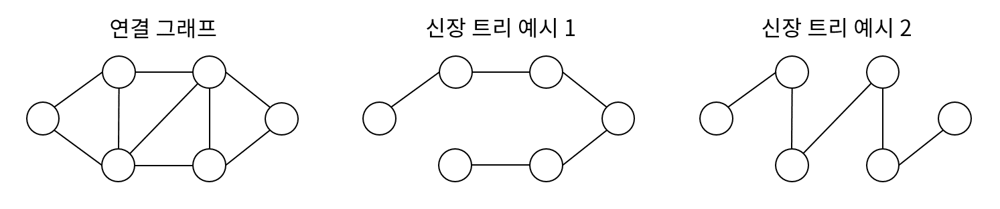

### 신장트리란?
스패닝 트리라고도 부른다. 모든 임의의 정점이 연결된 그래프인 연결 그래프의 부분 그래프다. 모든 정점이 간선으로 연결되어 있지만 사이클이 존재하지 않는 그래프다.

### 최소 신장 트리(Minimum Spanning Tree, MST)
신장트리를 구성하는 간선들의 가중치 합이 가장 작은 신장 트리이다.
신장트리를 구현하는 알고리즘은 두가지가 있다.
- 크루스칼 알고리즘
- 프림 알고리즘

## 프림(Prim) 알고리즘
- 그리디 알고리즘
매 순산 최선의 조건을 선택하는 그리디 알고리즘에 바탕을 둔다.
탐색 정점에 대해 연결된 인접 정점들 중 비용이 가장 적은 간선으로 연결된 정점을 택한다.

1. 아무 정점이나 하나 골라서 우선순위 큐에 넣는다.
2. 현재 내 영토에 속한 모든 정점들에서 바깥으로 뻗어나가는 모든 간선들 중에, 방문하지 않은 간선을 후보로 올린다.
3. 간선들 중 가중치가 가장 작은 간선을 하나 택한다.
4. 그 간선과 연결된 새로운 정점을 방문하고 방문처리한다 -> 3번과 4번을 계속 반복한다.

Java로 구현할때에는, PriorityQueue를 사용하여 구현한다.

시간 복잡도 : O(ElogV)

## 크루스칼 알고리즘
크루스칼 알고리즘은 프림 알고리즘과 다르게, 시작점이 아닌, 간선들 중 가장 싼 것부터 줍는 방식이다.

1. 모든 간선들을 나열하고, 가중치를 기준으로 작은순(오름차순)으로 정렬한다.
2. 가장 저렴한 간선을 꺼낸다.
3. Cycle 검사를 해야한다. 이 간선을 연결했을 때, 기존에 연결해 둔 간선들과 맞물려 순환이 생기는지 확인해야한다.
- 사이클이 안생기면 정답
- 사이클이 생기면, 버리고 다음 간선을 찾는다.
4. 선택해서 연결한 간선의 개수가 정확히 V-1개가 되면, 모든 정점이 연결된 완벽한 트리가 완성된 것임.

### 사이클이 생기는지 아는 방법
Union-find 알고리즘을 사용한다.
Find : 연결하려는 정점의 가장 최상단(루트 노드)를 찾습니다. 
- 두 루트노드가 같다면 -> 사이클이 생김. -> 버림
- 보스가 다르다면 연결

Union : A와 B를 연결하기로 했다면, 두 그룹을 합침. B의 루트노드를, A의 밑으로 합침.  parent[rootB] = rootA;

시간 복잡도 : O(ElogE) 