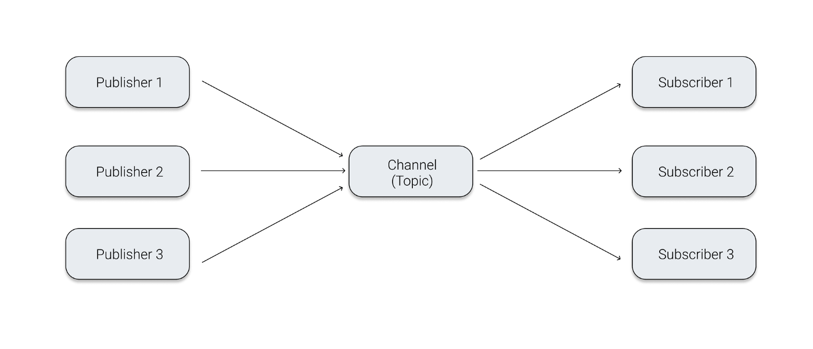
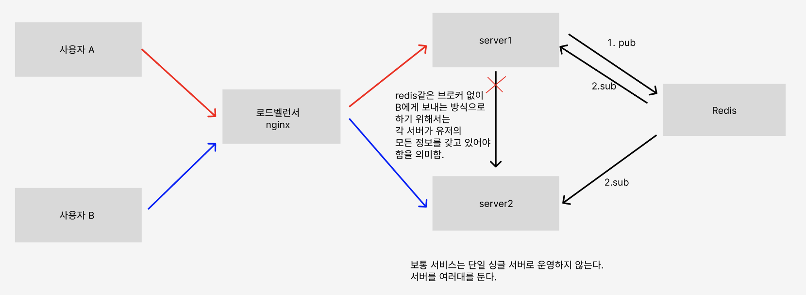

# 웹소켓 & 실시간 통신 개념 정리

---

## 목차
1. [실시간 통신 방식](#1-실시간-통신-방식)
2. [WebSocket](#2-websocket)
3. [STOMP](#3-stomp)
4. [미들웨어](#4-미들웨어middleware)
5. [메시지 큐 (Message Queue)](#5-메시지-큐-message-queue)
6. [Pub/Sub 패턴](#6-pubsub-패턴)
7. [메시지 브로커 vs 이벤트 브로커](#7-메시지-브로커-vs-이벤트-브로커)
8. [RabbitMQ](#8-rabbitmq)
9. [Kafka](#9-kafka)
10. [Spring WebMVC vs WebFlux](#10-spring-webmvc-vs-webflux)
11. [리액티브 프로그래밍](#11-리액티브-프로그래밍)
12. [이벤트 루프](#12-이벤트-루프)
13. [Redis](#13-redis)
14. [PostgreSQL vs MySQL](#14-postgresql-vs-mysql)
15. [MSA 아키텍처](#15-msa-아키텍처)

---

## 1. 실시간 통신 방식

원래는 클라이언트가 서버에게 말을 걸어주는 방식임.  
서버는 클라이언트가 말을 걸어주지 않으면 응답을 못함.  
이게 보통 HTTP 통신 방식이고, 이것을 **반 이중 통신(half duplex communication)** 이라고 함.

### 1-1. Polling
클라이언트가 서버로 **주기적으로 요청**을 보내는 방식.

### 1-2. Long Polling
클라이언트가 요청을 **걸어두는** 방식.
서버에 데이터가 변경된다면 그때 즉각 응답 가능. 데이터가 변경되는 즉시 응답을 받을 수 있다.  
Regular Polling과 비교했을 때 트래픽이 적다.  
단점: 연결을 계속 유지해야 한다.  

### 1-3. Server-Sent Events (SSE)
서버가 클라이언트에게 지속적으로 데이터를 전송하는 방법.
- 처음에 클라이언트가 req를 보내며 서버와 연결함
- 서버는 그 이후 지속적으로 데이터(이벤트)를 전송함
- 연결이 끊어지면 클라이언트가 자동으로 재연결 요청을 보냄
- 푸시 알림, 주식 실시간 업데이트 등에서 활용 가능

단점:
- 클라이언트 → 서버 방향으로 데이터를 보내야 할 경우 별도의 HTTP 통신이 필요
- 많은 클라이언트와의 지속적인 연결 유지 시 한계가 있을 수 있음

---

## 2. WebSocket

HTTP가 단방향 프로토콜이라면, WebSocket은 **양방향 통신 프로토콜**이다.
HTTP와 함께 OSI 7계층에 위치하고 있음.
TCP의 양방향 **전이중 통신(Full-Duplex)** 을 사용하여 Transport Layer(4계층)에 의존함.

### 2-1. WebSocket 동작 과정

#### 1. HandShake
HTTP HandShake를 통해 시작됨. 클라이언트가 서버에 WebSocket 연결 요청, 서버는 승인.
- Client request의 HTTP Header에 WebSocket 프로토콜로 업그레이드 요청을 포함
- 서버는 `101 Switching Protocols` 메시지로 업그레이드 승인

#### 2. Data Transfer
이제 TCP처럼 전이중 통신이 가능해짐.
- URL은 `http://`, `https://` 대신 `ws://`, `wss://` 를 사용
- 데이터는 **프레임(Frame)** 단위로 전송
- 프레임은 Header와 Payload로 구성됨

추가로 더 공부할 부분:
- 프레임의 유형
- Mask
- Ping/Pong

#### 3. Connection Termination
서버 또는 클라이언트 한쪽이 종료 프레임을 전송함.
수신받은 쪽은 똑같이 종료 프레임을 전송하고, TCP 연결이 종료된다.

---

### 2-2. HTTP vs WebSocket 비교

| 항목 | HTTP | WebSocket |
|------|------|-----------|
| 연결 방식 | Connectionless | 연결 유지 |
| 통신 방향 | 단방향 (요청/응답) | 양방향 |
| 상태 | Stateless | Stateful |
| 헤더 크기 | 큼 | 작음 |
| 데이터 형식 | 텍스트, 바이너리 | 텍스트, 바이너리 |
| 실시간성 | 낮음 | 높음 |
| 주요 용도 | RESTful API | 실시간, 게임, 채팅 |
| 전송 방식 | 프레임 방식 없음 | 프레임 단위 전송 |
| 포트 | 80(HTTP), 443(HTTPS) | 80(ws://), 443(wss://) |
| 핸드셰이크 | 각 요청마다 | 초기 1회 후 연결 지속 |

---

### 2-3. WebSocket의 한계와 해결 방법

- **브라우저 호환성**: 모든 브라우저가 WebSocket을 지원하지 않음
  - Polling, Long Polling, Streaming 등 대체 기술 사용
- **비구조적 데이터**: 텍스트와 바이너리 프레임만 전송 가능해 구조가 정해져 있지 않음
  - **STOMP**를 사용해 메시지를 구조화된 형태로 관리
- **보안 문제**
  - `ws://` 대신 `wss://` 사용 (SSL/TLS 암호화)
  - **XSS 공격**: 공격자가 클라이언트 측 스크립트를 웹페이지에 삽입 → HTML 특수문자 이스케이프 처리로 방어
  - **CSRF 공격**: 공격자가 인증된 사용자를 대신해 요청을 보내는 공격 → WebSocket 연결 설정 시 CSRF 토큰으로 정당성 확인
- **인증 및 권한 부여**: 연결 설정 후 JWT 토큰 등 인증 토큰으로 클라이언트 신원 확인 및 권한 검증 필요
- **서버 자원 고갈**: 지속적인 연결 유지로 공격자가 대량의 WebSocket을 열어 자원을 고갈시킬 수 있음
  - 연결 수 제한 + 일정 시간 동안 통신 없으면 연결 종료

---

## 3. STOMP

**STOMP (Simple Text Oriented Messaging Protocol)**
: WebSocket 위에서 동작하는 메시징 프로토콜

> WebSocket은 "양방향 연결 통로"를 뚫어주기만 하는 것이고,
> 그 위에 어떤 형식(프로토콜)으로 메시지를 주고받을지 정해주는 게 STOMP이다.

### 발행/구독 (Pub/Sub) 모델
- 클라이언트가 특정 토픽(채널)을 구독함
- 서버가 그 토픽으로 메시지를 발행(publish)하면 구독자 전원이 수신

---

## 4. 미들웨어(Middleware)

- **중간에 위치하는 소프트웨어**
- 서로 다른 애플리케이션, 데이터베이스, 통신 프로토콜 사이에서 다리 역할을 하며 서로 소통할 수 있도록 돕는 서비스

### 미들웨어 역할
- **통신 중재**: 서로 다른 네트워크 프로토콜이나 운영체제 환경에서 데이터가 오갈 수 있게 함
- **데이터 관리**: DB 접근이나 분산 데이터를 통합하는 과정을 단순화
- **부하 분산**: 서버에 요청이 몰릴 때 적절히 분산시켜 시스템 안정성 유지
- **보안 및 인증**: 사용자 인증이나 권한 확인 같은 보안 기능 처리

### 미들웨어의 종류

| 종류 | 설명 | 예시 |
|------|------|------|
| WAS (Web Application Server) | 웹 환경에서 동적 콘텐츠(비즈니스 로직) 처리 | Tomcat, Jeus |
| RPC (Remote Procedure Call) | 원격에 있는 함수/프로시저를 로컬처럼 호출 | gRPC |
| MOM (Message Oriented Middleware) | 메시지 기반 비동기 통신 지원 | RabbitMQ, Kafka |
| DB 미들웨어 | 애플리케이션과 DB 서버 간의 연결 관리 | ODBC, JDBC |
| API Gateway | 클라이언트 요청을 받아 마이크로서비스로 라우팅 | Spring Cloud Gateway |

### 미들웨어를 왜 쓰나요?
- **개발 효율성**: 통신이나 보안 같은 복잡한 하위 계층 로직을 직접 구현할 필요 없음
- **유연성**: 시스템 일부 변경/확장 시 전체를 뜯어고치지 않고 미들웨어 설정만으로 대응 가능
- **표준화**: 클라우드, 온프레미스 등 다양한 환경에서 일관된 방식으로 데이터 교환 가능

---

## 5. 메시지 큐 (Message Queue)

- 애플리케이션이나 시스템 간에 데이터를 **비동기적으로** 주고받을 수 있도록, 중간에서 임시로 데이터를 보관해주는 기술
- 주로 MSA처럼 여러 개의 독립적인 서비스들이 서로 데이터를 주고받아야 할 때 사용되는 아키텍처 패턴

---

## 6. Pub/Sub 패턴

- 메시지 지향 미들웨어(MOM)에서 사용하는 **비동기 메시징 패턴**
- Publisher가 Topic에 메시지를 보내면, 해당 Topic을 구독해놓은 Subscriber 모두에게 메시지가 전송되는 방식
- **브로커(Broker) 또는 토픽(Topic)을 통해 통신하는 것이 핵심**

### 핵심 구성 요소

| 구성 요소 | 설명 |
|-----------|------|
| Publisher | 특정 수신자가 아닌 특정 Topic에 메시지를 게시 |
| Topic | 메시지가 전달되는 중간 통로, 게시판 역할 |
| Subscriber | 관심 있는 Topic을 구독. 새로운 메시지가 오면 브로커로부터 수신 |
| Broker | 발행자와 구독자 사이에서 메시지를 필터링하고 배달하는 중재자 (예: Kafka, RabbitMQ, Redis Pub/Sub) |

---

## 7. 메시지 브로커 vs 이벤트 브로커

### 메시지 브로커
- 서비스 간의 메시지 전달을 중개
- 서비스 간 결합도를 낮추고, 메시지 전달의 신뢰성을 높임
- 장애 발생 시 메시지 손실 방지, 순서 보장 등의 기능 제공
- **데이터의 수명이 짧음** (메시지를 소비하면 사라짐)
- 서로 다른 시스템 간의 통신(비동기 처리)에 집중
- 예: **RabbitMQ**

### 이벤트 브로커
- 이벤트를 게시하고 구독하는 역할
- 대용량의 데이터를 실시간으로 처리할 수 있음
- **데이터 영구 저장** 기능 제공 (소비 후에도 설정 기간 동안 보관 → 장애 복구 유리)
- 메시지 브로커의 기능을 포함하며, 이벤트 저장 능력이 추가됨
- 예: **Apache Kafka**

---

## 8. RabbitMQ

- MOM(메시지 지향 미들웨어) 기반 **메시지 브로커**
- Pub/Sub 모델에서 Broker 역할
- STOMP 프로토콜과 연계 가능 (Spring WebSocket의 Broker Relay로 활용)
- 서버 스케일 아웃 시에 훨씬 유리
- Simple Broker 대비 성능 테스트 시 더 나은 선택

---

## 9. Kafka
- **대용량 데이터를 실시간으로 전달하고 처리하는 분산 메시징 플랫폼**
- Pub-Sub 모델을 따름. Pub-Sub에서 Broker 역할
- 주로 기업에서 대규모 데이터 처리 및 이벤트 기반 시스템 구축에 사용
- **이벤트 브로커**에 해당

### Kafka를 사용하는 이유

| 특징 | 설명 |
|------|------|
| 높은 처리량 | 짧은 시간에 대량의 데이터를 지연 없이 처리 → 빅데이터 시스템에서 필수 |
| 확장성 | 데이터 양이 늘어나면 서버(Broker)를 추가하기만 하면 됨 |
| 영속성 | 메시지를 메모리가 아닌 디스크에 저장. 소비 후에도 설정 기간 동안 보관 (장애 복구 유리) |
| 분산 처리 | 데이터를 여러 서버에 나누어 저장. 한 대 고장나도 시스템이 멈추지 않음 |
---

## 10. Spring WebMVC vs WebFlux

스프링에는 WebMVC와 WebFlux, 2가지 웹 프레임워크가 있음.

### 용어 정리

| 용어 | 설명 |
|------|------|
| 동기 | 호출과 응답이 동시에 이루어짐 |
| 비동기 | 호출과 응답이 동시에 이루어지지 않음 |
| 블로킹 | 함수를 call했을 때 응답을 받기 위해 멈춰있는 상태. 함수가 종료되어야 다음 줄 실행 |
| 논블로킹 | 함수를 call했을 때 결과를 받기 위해 멈춰있지 않고 다음 줄을 실행하는 상태 |

### Spring WebMVC
**동기적 블로킹** 방식
- 사용자 요청마다 스레드를 생성 (스레드 풀)
- 많은 사용자가 동시 요청을 보내면 요청을 처리하지 못함 (**Thread Pool Hell**)
- 시스템 트래픽을 설정해서 스레드 풀 크기를 잘 조정해야 함
- Spring Boot에서 제공하는 WebSocket 라이브러리를 바로 이용 가능 (라이브러리가 WebMVC 기반)
- 학습 곡선이 비교적 낮음
- **단점**: WebSocket 커넥션 하나 당 스레드 하나를 반드시 점유 → 사용자가 늘어날수록 서버에 필요한 메모리 증가

### WebFlux
**비동기적 논블로킹** 방식
- 리액티브 프로그래밍 기반
- 이벤트 루프(Event Loop) 사용
- 모든 코드가 non-blocking하게 동작해야 함
- Reactive 기반이라 직접 Raw WebSocket 통신을 이용해야 해서 **구현 난이도 훨씬 높음**
- Reactive 통신을 제공하는 Redis를 브로커로 이용해야 함
- **장점**: 이벤트 루프 기반이라 리소스 사용량이 훨씬 적어 대규모 트래픽에 유리

---

## 11. 리액티브 프로그래밍

---

## 12. 이벤트 루프

---

## 13. Redis
- 인메모리 기반 Key-Value 저장소
- 캐싱, Pub/Sub, 세션 저장 등 다양한 용도로 활용
- WebFlux 환경에서는 Reactive Redis를 브로커로 활용 가능
- 다중 인스턴스 환경에서 Redis Pub/Sub을 Simple Broker와 함께 사용 가능하지만, 단일 인스턴스 환경이라면 굳이 필요 없음

#### 웹소켓에서 왜 Redis가 필요할까?

배경: 로드밸런서(Nginx)를 통해 트래픽을 분산하는 다중 서버(Scale-out) 환경.

문제점: 서버 간 유저의 접속 상태가 공유되지 않아, 다른 서버에 접속한 유저에게 직접 메시지를 보내기 어려움 (모든 서버가 전체 유저 정보를 동기화하는 것은 비효율적).

해결책: Redis를 메시지 브로커로 도입 (Pub/Sub 패턴 활용)

Pub (발행): 메시지를 받은 서버(server1)는 수신자 위치를 찾지 않고 Redis 채널에 메시지 발행.

Sub (구독): 모든 서버(server1, server2)는 Redis를 구독하고 있으므로 해당 메시지를 동시에 수신.

전달: 메시지를 수신한 서버 중, 실제 수신자와 연결되어 있는 서버(server2)가 유저에게 최종 전달.

참고자료: https://wkdwoo.tistory.com/3

---

## 14. PostgreSQL vs MySQL

- PostgreSQL이 MySQL에 비해 **지리적 좌표 저장에 압도적으로 유리**
- 협업/지도 기반 기능이 있다면 RDB는 전체적으로 PostgreSQL로 통일해도 충분해 보임

---

## 15. MSA 아키텍처

## 17. TODO

아직 내용이 채워지지 않은 개념들. 아래 항목들을 추가로 정리할 것.

- [ ] **HTTP + SSE 상세 정리**
    - SSE의 구체적인 구현 방법 (Spring `SseEmitter`, Flux)
    - SSE vs WebSocket 선택 기준
    - SSE의 재연결 메커니즘 (`retry`, `Last-Event-ID`)

- [ ] **리액티브 프로그래밍 정리**
    - Reactive Streams 명세 (Publisher, Subscriber, Subscription, Processor)
    - Project Reactor (`Mono`, `Flux`) 개념 및 사용법
    - 배압(Backpressure) 개념

- [ ] **이벤트 루프 정리**
    - 이벤트 루프의 동작 원리
    - Node.js의 이벤트 루프와 WebFlux 이벤트 루프 비교
    - Netty 이벤트 루프 구조

- [ ] **RabbitMQ 상세 정리**
    - Exchange 종류 (Direct, Topic, Fanout, Headers)
    - Queue, Binding 개념
    - Spring WebSocket의 Broker Relay로 RabbitMQ 연동 방법
    - STOMP over RabbitMQ 설정

- [ ] **Redis 상세 정리**
    - Redis 자료구조 (String, Hash, List, Set, Sorted Set)
    - Redis Pub/Sub vs 메시지 큐 차이
    - Redis TTL 활용 (방 권한 정보 캐싱)
    - Spring Data Redis / Reactive Redis 사용법

- [ ] **PostgreSQL vs MySQL 상세 정리**
    - PostGIS 확장 (지리 좌표 저장 및 쿼리)
    - JSONB 지원 차이
    - 동시성 처리 방식 차이 (MVCC)

- [ ] **MSA 아키텍처 정리**
    - 모놀리식 vs MSA 구조 비교
    - 서비스 간 통신 방법 (REST, gRPC, 이벤트 기반)
    - API Gateway 역할
    - 서비스 디스커버리

- [ ] **WebSocket 프레임 구조 심화**
    - 프레임 유형 (Text, Binary, Ping, Pong, Close)
    - Masking 처리 방식

---

출처
- https://hwanheejung.tistory.com/42
- https://www.youtube.com/watch?v=i4-MNzNML_c
- https://pearlluck.tistory.com/726
- https://velog.io/@haron/PUBSUB-PUBSUB을-파헤쳐보자
- https://medium.com/@0joon/10분안에-알아보는-kafka-bed877e7a3bc
- https://wkdwoo.tistory.com/3
xw